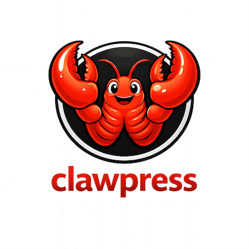

# ClawPress



The AI for WordPress that actually does things

[Preview in WordPress Playground](https://playground.wordpress.net/?blueprint-url=https://raw.githubusercontent.com/bradvin/clawpress/refs/heads/main/blueprint.json)

## Quick Start

```bash
composer install
npm install
npm run build
```

## Key Features

### Admin Assistant MVP

Current MVP features implemented in this plugin:

- Floating chat panel available across all admin screens to chat with your AI assistant.
- Admin bar toggle (`🦞`) to open / close the chat panel.
- Offline mode which still allows slash commands to be used.
- Setup Wizard built into chat to guide users through plugin setup process.
- Admin settings page to set which provider, model, and other settings to use.
- Registers WP Abilities to and loads them as tools into the AI client.
- Creates an action log database table to track actions taken by the AI assistant.
- Context & system prompt built up using chat history, tools (abilities), agent files & memory.
- Card UI system to display information in a card format.
  - Included cards : Welcome card, Setup Wizard card, User Permissions card.
- Shows context usage with toolip.

Current Agent Features:

- Access to agent files (AGENTS.md, SOUL.md, BOOTSTRAP.md) (stored in `clawpress-agent-file` custom post type).
- Persistent agent memory (stored as `clawpress-agent-mem` custom post type). (Short term memory, long term memory)
- Access to a secure workspace file-system located at `/wp-content/uploads/<agent-user-id>/<random-hash>`
- Has an assigned WordPress user. (this user will be used to perform heartbeat tasks)
- Agent abilities:
  - `file_list` (read from agent-files first then workspace)
  - `file_read`
  - `file_write`
  - `file_delete`
  - `memory_long_term_add`
  - `memory_long_term_update`
  - `memory_long_term_delete`
  - `memory_short_term_add`
  - `memory_short_term_update`
  - `memory_short_term_delete`

### Slash Commands

- `/help` - shows availalble commands.
- `/clear` - Clears chat history.
- `/status` - Shows plugin status.
- `/tools` - Shows registered abilities (tools).
- `/site info` - Shows site information.
- `/memory list|clear` - Shows agent memory.
- `/setup` - Runs the setup wizard.
- `/test` - Runs a test to ensure the AI client is working.
- `/reset` - Resets the chat history and shows Welcome card.

## Technical Details

- Uses modern WordPress patterns for admin pages and REST API.
- Uses `@automattic/jetpack-autoloader` for autoloading. ([docs](https://github.com/Automattic/jetpack-autoloader))
- Uses `@wordpress/php-ai-client` for AI client. ([docs](https://github.com/WordPress/php-ai-client))
- Uses `@woocommerce/action-scheduler` for background processing. ([docs](https://github.com/woocommerce/action-scheduler))
- Includes admin table/grid interface using `@wordpress/dataviews` with WordPress Data Layer.
- Uses `wp-scripts` for build tooling. ([docs](https://developer.wordpress.org/block-editor/packages/packages-scripts/))
- Uses `phpunit` for unit testing.
- Uses `wp-coding-standards` and `phpcodesniffer` for code quality.
- Built from Brian Coords [woodev-extension-starter](https://github.com/bacoords/woodev-extension-starter)

### REST API

Custom endpoints with permission callbacks and parameter validation.

- Namespace: `clawpress/v1`
- Endpoints:
  - `/settings` (GET/POST)
  - `/status` (GET)
  - `/panel/state` (GET/POST)
  - `/chat/message` (POST)
  - `/chat/history` (GET)
- Location: `includes/class-rest-api.php`

## Dependencies

### Runtime
- `@wordpress/dataviews` - Table/grid UI components
- `@wordpress/icons` - Icon library

### Development (npm)
- `@wordpress/scripts` - Build tooling

### Development (Composer)
- `wp-coding-standards/wpcs` - WordPress Coding Standards for PHP_CodeSniffer

## Patterns Used

| Pattern | Purpose |
|---------|---------|
| Namespaced PHP classes | Isolated features, no conflicts |
| Config-driven UI | Modify fields/actions without touching components |
| Custom hooks | Encapsulated data logic |
| REST API with validation | Clear frontend/backend contract |
| Asset file pattern | Auto-managed dependencies |
| wp-scripts build tooling | Zero-config builds |
| WordPress admin menu page | Proper admin page integration |

## Requirements

- PHP 8.1+
- WordPress 6.9+
- Node.js 18+

## TODO

- Fix context usage info / limit / tooltip.
- Add current admin screen to context.
- Persist tool calls to chat history
- Define actual scope of agent user. (should the user only be used for heartbeat tasks?)
- Agent skills!
- Chat threads - have multiple conversation threads at once, per user.
- Improve agent loop for multi-step messages
- Add heartbeat wizard for setting up useful nightly site health email report.
- Implement working heartbeat tasks.
- Use WP_Filesystem to read/write files
- Add abilities to read memory files (long and short term)
- Fix boostrap agent file setup and writing (doesnt always run)
- /reset command should clear everything (like uninstall + activation)
- Add more agent abilities for general WordPress content (posts, pages, etc.)
- Consider how browser search and use will work within WordPress.
- Mulit agent support. (can configure multiple agents)
- Multi-user support. (each user has their own agents)
- Channels for agent interaction.
- Streaming responses.

## Decision Log

1. Storage model: (custom table + CPT + filesystem workspace).
2. Memory management: `clawpress_agent_mem` CPT (long term and short term).
3. Skills management: `clawpress_agent_skill` CPT.
4. Workspace location: uploads subdirectory with non-guessable randomized folder names.
5. Retention baseline: configurable TTL with Action Scheduler purge jobs.
6. Agent action model: execute actions as selected WP agent user (recommended low-privilege dedicated account).
7. System prompt built up from small system prompt + chat history + tools + agent files + memory.
8. File model: built-in file tools resolve `clawpress_agent_file` CPT first, with workspace filesystem fallback.
9. Tool model: all ClawPress tools are abilities (Abilities API).
10. Background scheduling model: Action Scheduler (not WP-Cron).
11. Cards are used to display complex UI in chat panel.
12. Commands can be used offline.
13. Cards can have actions, which run commands, or send messages.